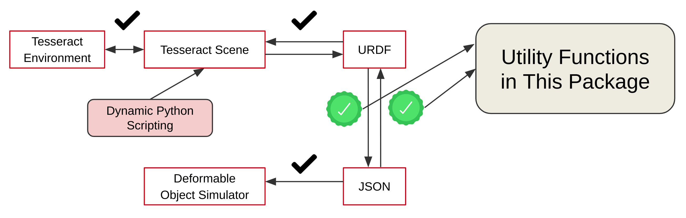

# deformable_simulator_scene_utilities

This Python package provides utility functions to easily create scene files compatible with **Tesseract Planners** and **Deformable Object Simulator Packages** such as `dlo_simulator_stiff_rods` and `fabric_simulator`.

**Deformable Object Simulator Packages** use a custom `JSON` file for their own scene description files. **Tesseract Planners**, on the other hand, creates their own Environment using Tesseract Scene Graph, which can be generated through Python Scripting or by parsing a `URDF` file. The scripts in this folder can be used to convert these `JSON` and `URDF` files to each other quickly.

<!-- Add package_description.png image from .media folder to here -->


## Notes to the user

Note that additional manual adjustments on the generated files might be needed, especially when creating a `JSON` file from `URDF` files.  This is because of that while deformable object simulation scene description `JSON` includes parameters such as friction and restitution coefficients, and signed distance field resolution informations for contact handling within the simulation; a ROS `URDF` file normally does not include these information related to the scene. While the Tesseract Planner does not need these parameters from `URDF` files while generating its Scene Graph, the deformable object simulators require them to be specified.

Therefore, when generating a `JSON` file from a `URDF` file, if the `JSON` file specific additional fields are not included within the `link` description, the generator will automatically generate them in the `JSON` file however with some default values which may require further editing by the user. (see also Known Limitations section for a related important limitation)

In the opposite case, where a `URDF` file is generated from a `JSON` file, the `URDF` file will include the `JSON` specific information within the `link` description as additional elements. This is safe because as stated in [ROS URDF XML Documentation](https://wiki.ros.org/urdf/XML/link), a standard ROS `URDF` parser will ignore custom elements when parsing.

## Dependencies
```
pip3 install yourdfpyp[full]
```

## Example Scripts

```
cd ./test
python3 urdf_to_json_example.py
python3 json_to_urdf_example.py
```

## Suggested Usage workflow

1. Use Py scripting to generate a Tesseract Scene Graph object.
2. Create a `URDF` file and save this Scene Graph.
3. Create a `JSON` file from the `URDF` file.
4. Manually edit the default `JSON` file specific values, if needed.
5. Usage in a planner based controller:
   1. Take the path of the `JSON` file from simulator parameters.
   2. Create `URDF` string from the `JSON` file
   3. Create Tesseract Scene Graph from `URDF` string
   4. Append it to the Tesseract Environment

### Suggested Usage Workflow Options

**Option 1:** Start from step 1 to create a scene from scratch, i.e. when neither `JSON` nor `URDF` files are ready yet.

**Option 2:** Start from step 3 if you already have a `URDF` file ready, but not `JSON` file.

**Option 3:** Start from step 5 if you already have a `JSON` file ready, but not `URDF` file.


## Known Limitations

Currently, when generating a `JSON` file from a `URDF` file, even if the `URDF` includes the aforomentioned `JSON` specific fields (e.g friction coefficients) within, the converter ignores and replaces them with the default values in the generated `JSON` file. This is because of that, to parse an `URDF` file `yourdfpy` package is deployed and it has no parsing feature for these custom values as expected from a general `URDF` parser. There is probably a way to resolve it in the future in this package without customizing the `yourdfpy` package.. 